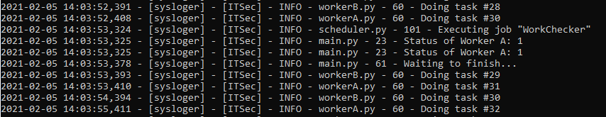

# Welcome to WORKERLand!

## Sumary:

WORKERLand is a sample program to understand Threading whit a Scheduler in Python. 

It simulates 2 threads in paralel and the result is handled by mail thread. There is another job to check the status of the jobs.

The workers do nothing.

## Main:

## Checker:

## Result:

Inputs are welcome!
